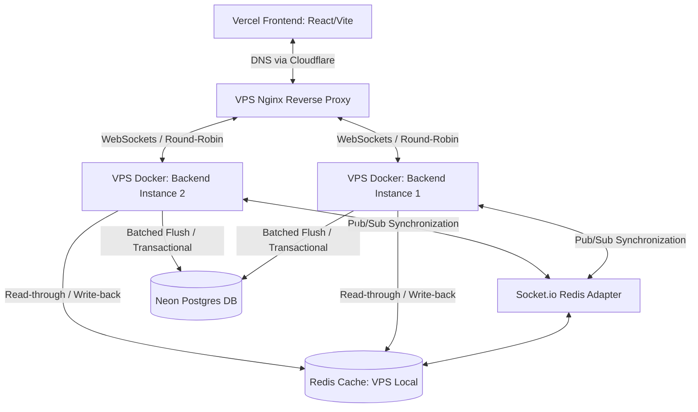

# Pixnette Technical Onboarding & Codebase Audit

This document provides a comprehensive technical audit of the Pixnette codebase. It serves as a thorough reference guide for understanding the system architecture, state transitions, data flows, API routes, and deployment topologies prior to a security or systems audit.

---

## 1. Architecture Overview

Pixnette is a real-time, collaborative pixel art canvas application designed to scale horizontally across multiple node instances. The application leverages a distributed architecture to sync real-time pixel placements, manage client cooldowns, and ensure persistent, batched storage.



### Running Services & Communication Flows
1. **Frontend (Vercel)**: Built with React, Vite, and TailwindCSS. Runs client-side in the user's browser.
   - Streams the current canvas representation using a binary payload (`application/octet-stream`) via an HTTP request.
   - Synchronizes canvas updates and placement events in real-time over a persistent WebSocket connection.
2. **Backend Clustered Nodes (VPS / Docker)**: Powered by Express, Node.js, and Socket.io. Scaled horizontally across multiple instances (e.g., `backend1` and `backend2`) on a VPS.
   - Communicates with client connections to validate pixel coordinates, color indexes, rate-limits, and cooldown states.
   - Coordinates multi-instance socket synchronization by utilizing a central Redis Pub/Sub backplane.
3. **Cache Tier (Redis)**: Holds the canvas state as a raw binary buffer, tracks active user cooldown keys, and queues pixel writes prior to database flushing.
4. **Database Tier (Neon Postgres)**: Persistent transactional storage.
   - Holds historical logs of every pixel placement for timelapse playback.
   - Holds the final, single-state grid of coordinates representing the current canvas state.

### Docker Setup
- **Services**: The VPS runs two backend containers (`backend1`, `backend2`) side-by-side.
- **Networks**: Bound together via a shared Docker network (e.g., a default bridge network) to allow internal routing.
- **Volumes**: Stateless containers; since all volatile state is in Redis and persistent state is in Neon Postgres, the backend containers do not mount persistent volumes, allowing them to spin up and down dynamically.

### Nginx Configuration & Security Gateway
Nginx operates on the VPS as a reverse proxy, accepting external traffic from Cloudflare over a secure TLS connection and routing it to the internal Docker backend containers.
- **Upstream Target Block**:
  ```nginx
  upstream pixnette_backend {
      server backend1:3001;
      server backend2:3001;
  }
  ```
- **Load Balancing Strategy**: Standard round-robin. Because the Socket.io client connects directly via WebSockets, session affinity is not required.
- **HTTPS & SSL Termination**: Listen on port `443 ssl`, routing connections via Cloudflare Origin Certificates (`origin.crt`, `origin.key`). All port 80 traffic is redirected to HTTPS.
- **Visitor Real-IP Restoring**: Trust Cloudflare edge nodes by whitelisting all official Cloudflare IPv4 & IPv6 ranges and mapping the incoming `CF-Connecting-IP` header to `$remote_addr`.
- **API Rate Limiting**: Applies `limit_req_zone` targeting `$binary_remote_addr` (which now correctly holds the client's real IP). Limits `/api/` endpoints to `10r/s` with a `burst=20`.
- **Routing Rules**:
  - HTTP routes `/api/*` are reverse proxied to the upstream block with rate-limiting.
  - WebSocket connection requests (`/socket.io/*`) are proxied with headers ensuring protocols are upgraded:
    ```nginx
    proxy_http_version 1.1;
    proxy_set_header Upgrade $http_upgrade;
    proxy_set_header Connection "upgrade";
    proxy_set_header Host $host;
    proxy_set_header X-Real-IP $remote_addr;
    proxy_set_header X-Forwarded-For $proxy_add_x_forwarded_for;
    ```

---

## 2. Redis Usage Map

Redis serves as an in-memory database and synchronization bus. To handle binary data cleanly, the server defines two clients: a standard text-based client (`pubClient`) and a buffer-mapped client (`bufferClient`) that maps Redis string blobs directly to Node.js `Buffer` objects.

### Files Importing Redis Clients
1. **[redis.js](file:///d:/Projects/rplace-pixnette/backend/redis.js)**: Configures and exports `pubClient`, `bufferClient`, `subClient`, and the `connectRedis` function.
2. **[canvas.js](file:///d:/Projects/rplace-pixnette/backend/canvas.js)**: Imports `pubClient` and `bufferClient` to manage the cached canvas binary state.
3. **[cooldown.js](file:///d:/Projects/rplace-pixnette/backend/cooldown.js)**: Imports `pubClient` to check, set, and fetch user placement cooldowns.
4. **[writeQueue.js](file:///d:/Projects/rplace-pixnette/backend/writeQueue.js)**: Imports `pubClient` to manage the write-back cache queues and handle transaction recovery.
5. **[server.js](file:///d:/Projects/rplace-pixnette/backend/server.js)**: Imports the clients to initialize connections and attach the `@socket.io/redis-adapter` for multi-instance event synchronization.
6. **[erase-db.js](file:///d:/Projects/rplace-pixnette/backend/erase-db.js)**: Imports `pubClient` to flush the database cache during data resets.
7. **[test-write-queue.js](file:///d:/Projects/rplace-pixnette/backend/test-write-queue.js)**: Imports `pubClient` to clear keys and mock DB failures during queue stability tests.

### Client-to-Operation Mapping
- **`pubClient` (Standard client)**:
  - `pubClient.exists('canvas:state')`: Verifies if the canvas state is cached.
  - `pubClient.strLen('canvas:state')`: Validates the size of the cached canvas matches expectations.
  - `pubClient.del('canvas:state')`: Purges canvas cache when reinitializing.
  - `pubClient.set('canvas:state', buffer)`: Populates the initial canvas binary buffer.
  - `pubClient.setRange('canvas:state', offset, buffer)`: Updates a single coordinate byte.
  - `pubClient.exists('cooldown:<fingerprint>')`: Checks if a user's cooldown is active.
  - `pubClient.set('cooldown:<fingerprint>', '1', { EX: secs })`: Sets user cooldown with an expiration time.
  - `pubClient.ttl('cooldown:<fingerprint>')`: Fetches seconds remaining on cooldown.
  - `pubClient.hSet('pixel:write:queue', field, value)`: Enqueues pixel writes or restores them on failure.
  - `pubClient.exists('pixel:write:queue')`: Checks if any writes are queued.
  - `pubClient.rename('pixel:write:queue', tempKey)`: Locks the active queue by renaming it atomically.
  - `pubClient.hGetAll(tempKey)`: Retrieves the isolated batch of writes to flush.
  - `pubClient.del(tempKey)`: Deletes the temporary flush batch on completion.
  - `pubClient.hGetAll('pixel:write:queue')`: Fetches active writes to resolve conflicts during write rollbacks.
  - `pubClient.flushDb()`: Completely wipes the Redis database (in `erase-db.js`).
- **`bufferClient` (Buffer-mapped client)**:
  - `bufferClient.getRange('canvas:state', offset, offset)`: Retrieves a single byte (representing color index) at a specific coordinate offset.
  - `bufferClient.get('canvas:state')`: Retrieves the entire raw canvas buffer.
- **`subClient` (Subscriber client)**:
  - Attached to `@socket.io/redis-adapter` alongside `pubClient` inside `server.js` to coordinate event broad-casting across multiple backend nodes.

### Redis Keys Map
| Key Template | Type | TTL / Eviction | Contents & Purpose |
| :--- | :--- | :--- | :--- |
| `canvas:state` | `String` (Binary Blob) | Persistent | Stores the entire square canvas as a raw array of bytes (`CANVAS_SIZE * CANVAS_SIZE` bytes). Each byte represents a color index (0-15). |
| `cooldown:<fingerprint>` | `String` | Dynamic (e.g. 30s) | The value is set to `"1"`. Its presence indicates that the user (identified by `<fingerprint>`) is on placement cooldown. |
| `pixel:write:queue` | `Hash` | Persistent | The active write queue. Fields are `"x,y"` coordinates; values are formatted as `"<color>:<fingerprint>:<timestamp>"`. |
| `pixel:write:flush:<timestamp>` | `Hash` | Temporary | An atomic snapshot of the write queue being flushed to Postgres. Prevents new client writes from being blocked or dropped. |

---

## 3. Database Usage Map

Postgres (via Neon cloud hosting) acts as the source of truth for the final canvas coordinates and provides the transactional history of placements required for timelapse construction.

### Files Querying Postgres
1. **[canvas.js](file:///d:/Projects/rplace-pixnette/backend/canvas.js)**: Pulls all pixels from the database to initialize the Redis cache on server startup.
2. **[writeQueue.js](file:///d:/Projects/rplace-pixnette/backend/writeQueue.js)**: Runs batched transactions to insert/update pixel coordinates and log placement logs to history.
3. **[api.js](file:///d:/Projects/rplace-pixnette/backend/routes/api.js)**: Fetches the chronological history log of pixel placements.
4. **[setup-db.js](file:///d:/Projects/rplace-pixnette/backend/setup-db.js)**: Runs initialization DDL scripts to prepare schemas.
5. **[erase-db.js](file:///d:/Projects/rplace-pixnette/backend/erase-db.js)**: Truncates data tables on administrative resets.

### Database Tables Schema
#### Table: `pixels`
Stores only the latest state of each coordinate on the canvas.
- `x`: `SMALLINT NOT NULL` (Horizontal coordinate).
- `y`: `SMALLINT NOT NULL` (Vertical coordinate).
- `color`: `SMALLINT NOT NULL DEFAULT 0` (Color index, matches 0-15).
- `placed_at`: `TIMESTAMPTZ NOT NULL DEFAULT NOW()` (Latest modification timestamp).
- `fingerprint`: `TEXT` (Identifier of the user who colored the pixel).
- *Primary Key*: `(x, y)` (Enforces uniqueness per coordinate).
- *Index*: `idx_pixels_placed_at` on `placed_at`.

#### Table: `pixel_history`
An append-only log capturing every placement. Used to construct the timelapse.
- `id`: `SERIAL PRIMARY KEY` (Auto-incrementing record log identifier).
- `x`: `SMALLINT NOT NULL`
- `y`: `SMALLINT NOT NULL`
- `color`: `SMALLINT NOT NULL`
- `placed_at`: `TIMESTAMPTZ NOT NULL DEFAULT NOW()`
- `fingerprint`: `TEXT`
- *Index*: `idx_pixel_history_placed_at` on `placed_at`.

### Query Inventory
| Query Type | SQL Command | Target Parameters | Where Called |
| :--- | :--- | :--- | :--- |
| **SELECT** | `SELECT x, y, color FROM pixels` | None | `loadCanvasFromDB()` ([canvas.js](file:///d:/Projects/rplace-pixnette/backend/canvas.js)) |
| **SELECT** | `SELECT x, y, color FROM pixel_history ORDER BY id ASC` | None | `GET /api/canvas/history` ([api.js](file:///d:/Projects/rplace-pixnette/backend/routes/api.js)) |
| **UPSERT** | `INSERT INTO pixels (x, y, color, fingerprint, placed_at) VALUES ($1, $2, $3, $4, NOW()), ... ON CONFLICT (x, y) DO UPDATE SET color = EXCLUDED.color, fingerprint = EXCLUDED.fingerprint, placed_at = EXCLUDED.placed_at` | Flattened chunks of `[x, y, color, fingerprint]` up to 4000 rows | `flushQueueToPostgres()` ([writeQueue.js](file:///d:/Projects/rplace-pixnette/backend/writeQueue.js)) |
| **INSERT** | `INSERT INTO pixel_history (x, y, color, fingerprint) VALUES ($1, $2, $3, $4), ...` | Flattened chunks of `[x, y, color, fingerprint]` up to 4000 rows | `flushQueueToPostgres()` ([writeQueue.js](file:///d:/Projects/rplace-pixnette/backend/writeQueue.js)) |
| **TRUNCATE**| `TRUNCATE TABLE pixels, pixel_history RESTART IDENTITY` | None | `erase()` ([erase-db.js](file:///d:/Projects/rplace-pixnette/backend/erase-db.js)) |

---

## 4. Socket.io Event Map

Real-time events flow through Socket.io. Below is the mapping of events exchanged between the server nodes and the clients.

```mermaid
sequenceDiagram
    participant Client as React Client
    participant Server as Server Node (Express)
    participant Redis as Redis Pub/Sub

    Client->>Server: Connection (passes auth: { deviceId })
    Note over Server: Identifies user fingerprint
    Server->>Client: Emit "cooldown_sync" { remaining: Xs }
    Server->>Redis: Query Active Cluster Sockets
    Server->>Client: Broadcast "user_count" (N)

    rect rgb(30, 40, 50)
        Note over Client: User clicks placement
        Client->>Server: Emit "place_pixel" { x, y, color }
        Note over Server: Validates Rate limit, Bounds, & Cooldown
        Server->>Server: Writes to Redis Canvas State & Write Queue
        Server->>Redis: Broadcast Event through Cluster Adapter
        Server->>Client: Broadcast "pixel_update" { x, y, color } (to all clients)
        Server->>Client: Emit "cooldown_sync" { remaining: 30s } (to placing client)
    end
```



### Event Inventory
#### Server-Emitted Events
- `user_count` (Payload: `number`): Broadcasts the total count of connected client sockets across the cluster. Sent on client connection and disconnection.
- `cooldown_sync` (Payload: `{ remaining: number }`): Sends the remaining cooldown seconds (0 if ready) to a client. Sent on connection and immediately following a successful placement.
- `pixel_update` (Payload: `{ x: number, y: number, color: number }`): Broadcasts a validated pixel update to all connected clients.
- `place_error` (Payload: `{ message: string, x?: number, y?: number, color?: number }`): Notifies a client of a placement failure. If coordinate values are attached, they contain the original pixel color to allow the client to rollback their optimistic UI update.

#### Client-Emitted Events
- `place_pixel` (Payload: `{ x: number, y: number, color: number }`): Requests placement of a pixel at coordinate `(x, y)` with the specified color index.

### Event Listeners
- **Server Side**:
  - `connection`: Fired upon client socket handshake. Collects the client fingerprint, fetches cluster-wide connections, broadcasts `user_count`, and emits `cooldown_sync` to the connector.
  - `place_pixel`: Runs rate-limiting validations, coordinate checks, and cooldown lookups. If validation passes, commits the update and broadcasts `pixel_update`.
  - `disconnect`: Fired when a client connection terminates. Recalculates and broadcasts the active cluster-wide `user_count`.
- **Client Side**:
  - `connect` / `disconnect`: Updates connection status state in React.
  - `user_count`: Updates the local user count indicator in the top navbar.
  - `pixel_update`: Draws the updated pixel immediately to the HTML5 canvas grid.
  - `place_error`: Displays a floating warning toast and reverts the clicked pixel to its previous color.
  - `cooldown_sync`: Synchronizes client-side timers with the server's cooldown tracking.

### Middleware & Authentication Flow
- **Authentication**: Stateless and anonymous.
  - Upon connection, the backend attempts to read `socket.handshake.auth.deviceId` (client-generated UUID stored in localStorage).
  - If absent, it hashes the client's IP address (from the `X-Forwarded-For` header or fallback socket connection address) concatenated with their `User-Agent` string using SHA-256 (sliced to 16 characters).
- **Rate-Limiting Middleware**:
  - Validates placement frequencies on the `place_pixel` listener.
  - Uses an in-memory `eventRates` Map (`fingerprint` -> `{ count, resetAt }`) to track requests.
  - Clients sending more than 5 placement events per second are disconnected immediately using `socket.disconnect(true)`.
  - Cleans up stale entries every 60 seconds via `setInterval` to prevent memory leaks.

---

## 5. API Route Map

The HTTP REST API is exposed under the `/api` route prefix. It serves the initial state download and timelapse playback history.

### HTTP Endpoints
1. **`GET /api/canvas`**
   - **Method**: `GET`
   - **Handler**: `api.js` (routed to `getFullCanvas()`)
   - **Function**: Retrieves the raw binary canvas array from Redis and streams it directly to the browser with headers set to `Content-Type: application/octet-stream`.
   - **Input Validation**: None.
   - **Error Handling**: Wrapped in a try/catch block. If Redis is unreachable, details are logged to the console, and it returns a `500 Internal server error` status.
2. **`GET /api/health`**
   - **Method**: `GET`
   - **Handler**: Inline JSON responder.
   - **Function**: Returns a system health status payload: `{ status: 'ok', uptime: process.uptime(), pixels: TOTAL }`.
   - **Input Validation**: None.
   - **Error Handling**: None (trivial JSON return).
3. **`GET /api/canvas/history`**
   - **Method**: `GET`
   - **Handler**: `api.js` (queries Postgres pool directly)
   - **Function**: Queries `pixel_history` to retrieve every logged pixel change in chronological order (`ORDER BY id ASC`), returning the array under a JSON wrapper: `{ history: [...] }`.
   - **Input Validation**: None.
   - **Error Handling**: Wrapped in a try/catch block. If Postgres connection fails, logs error to console and returns `500` JSON: `{ error: 'Internal server error' }`.

---

## 6. Frontend Component Map

The user interface is a high-performance single-page app containing custom gesture-based translation logic and double-buffered HTML5 canvases for pixel-perfect rendering.

### Component Structure & Responsibilities
- **`App.jsx` (Central Coordinator)**
  - Orchestrates global layout boundaries.
  - Binds the real-time Socket hooks, Canvas state management hooks, and local Cooldown hook together.
  - Intercepts and blocks native mobile browser zoom behaviours (pinch-to-zoom and double-tap zoom defaults) to allow custom canvas panning and zooming.
- **`Canvas.jsx` (Dual-Canvas Viewer & Drag-to-Pan Controller)**
  - Renders the interactive viewport containing two layered canvases:
    1. **Primary Canvas**: Renders the canvas grid (64x64 or 512x512) with the CSS rule `image-rendering: pixelated` to keep pixels crisp.
    2. **Overlay Canvas**: Renders high-performance overlays (active selection borders and semi-transparent hover placement blocks).
  - Handles mouse wheel scrolling, mouse dragging, arrow keys, and multi-touch gestures to translate coordinates (`translate3d` and `scale`).
  - Utilizes a focal-point zoom equation to ensure the pixel under the user's cursor remains anchored during zooming operations.
- **`TimelapseView.jsx` (Timelapse Player Screen)**
  - Provides a fullscreen video-style interface for replaying canvas history.
  - Renders canvas history frames inside a dedicated loop using `requestAnimationFrame`.
  - Supports progress scrubbing, Play/Pause, speed adjustment buttons (1x to 500x), and PNG exporting.
- **`Toolbar.jsx` (Color Palette Picker & Status Panel)**
  - Integrates the placement trigger button, a visual countdown circle, and a responsive color picker:
    - **Desktop (>= 1024px)**: Single row displaying all 16 colors.
    - **Tablet (440px - 1024px)**: 2x8 Grid layout.
    - **Mobile (< 440px)**: A dropdown menu containing a grid selector overlay.
- **`Tooltip.jsx` (Information Tooltip)**
  - Floats beside the cursor to show coordinate values `(x, y)` and the hovered pixel's hex color.
  - Automatically bounds-checks its position to stay inside the viewport.
- **`TopBar.jsx` (Navbar Header)**
  - Displays the app name, dimensions, user count, connection indicator light, and the button to toggle Timelapse view.

### State Variable Inventory
- **Global / App State**:
  - `view` (`'canvas' | 'timelapse'`): Controls the current view panel.
  - `selectedColor` (`number`): The index (0-15) of the currently selected palette color.
  - `hoverCursor` (`{ x, y, clientX, clientY } | null`): Coordinates of the pixel currently being hovered.
  - `flash` (`string | null`): Alert message text for error banners.
- **Canvas Viewport State**:
  - `transform` (`{ scale, x, y }`): Zoom factor and viewport coordinate translations.
  - `isPanning` (`boolean`): Active drag flag.
- **Timelapse State**:
  - `history` (`Array`): Pixel placement log arrays.
  - `loading` (`boolean`): Loading spinner toggle.
  - `isPlaying` (`boolean`): True if playback loop is actively running.
  - `currentIndex` (`number`): The index in the history array representing the currently rendered frame.
  - `speed` (`number`): Playback rate representing pixels drawn per animation frame.
- **Toolbar State**:
  - `isDropdownOpen` (`boolean`): Opens or closes the mobile color selector.
- **Hooks State**:
  - `cooldownRemaining` (`number`): Seconds remaining before placement cooldown ends.
  - `isConnected` (`boolean`): Real-time connection status indicator.
  - `liveCount` (`number`): Connected user count.

### Canvas rendering Operations
- **`renderFullBoard` ([useCanvas.js](file:///d:/Projects/rplace-pixnette/frontend/src/hooks/useCanvas.js))**:
  - Creates image data: `ctx.createImageData(CANVAS_SIZE, CANVAS_SIZE)`
  - Modifies pixel RGBA values in a loop using values mapped from the palette.
  - Draws the state onto the canvas: `ctx.putImageData(imgData, 0, 0)`
- **`updatePixel` ([useCanvas.js](file:///d:/Projects/rplace-pixnette/frontend/src/hooks/useCanvas.js))**:
  - Colors a single canvas cell: `ctx.fillStyle = PALETTE[colorIndex]; ctx.fillRect(x, y, 1, 1)`
- **`drawHoverPixel` ([useCanvas.js](file:///d:/Projects/rplace-pixnette/frontend/src/hooks/useCanvas.js))**:
  - Wipes the overlay canvas: `ctx.clearRect(0, 0, CANVAS_SIZE, CANVAS_SIZE)`
  - Draws a semi-transparent selection preview: `ctx.fillStyle = PALETTE[colorIndex] + 'B3'; ctx.fillRect(x, y, 1, 1)`
  - Outlines the selection box: `ctx.strokeStyle = '#ffffff'; ctx.lineWidth = 0.5; ctx.strokeRect(x, y, 1, 1)`
- **`draw` ([TimelapseView.jsx](file:///d:/Projects/rplace-pixnette/frontend/src/components/TimelapseView.jsx))**:
  - Clears the timelapse canvas when scrubbing backwards: `ctx.fillStyle = '#ffffff'; ctx.fillRect(0, 0, CANVAS_SIZE, CANVAS_SIZE)`
  - Renders historical pixel placements step-by-step: `ctx.fillStyle = PALETTE[p.color]; ctx.fillRect(p.x, p.y, 1, 1)`
- **`handleExport` ([TimelapseView.jsx](file:///d:/Projects/rplace-pixnette/frontend/src/components/TimelapseView.jsx))**:
  - Extracts the current canvas image state for download: `canvas.toDataURL('image/png')`

---

## 7. CI/CD & Deployment

Deployments are automated through GitHub Actions, routing code changes directly to the production VPS and Neon database.

### CI/CD Workflow (`deploy.yml`)
On every push to the `main` branch, the workflow automates deployment:
- **Environment**: Runs on `ubuntu-latest`.
- **Steps**:
  1. Runs `appleboy/ssh-action@v1.0.3` to establish a secure SSH connection to the VPS using secrets: `VPS_IP`, `ubuntu` username, and the SSH key `VPS_SSH_KEY`.
  2. Executes the deployment script on the host VPS:
     ```bash
     cd ~/pixnette
     git pull origin main
     sudo docker compose up --build -d --no-deps backend1 backend2
     ```
     This pulls the latest commits, rebuilds the Node.js Docker environment, and restarts the clustered backend services without dropping connections on other running containers.

### Docker Compose Service Definition (VPS Local Network)
The VPS runs services inside isolated Docker Compose networks:
- **Services**:
  - `backend1`: Builds from `./backend`, runs internally on port `3001`, and pulls from the Shared Environment configuration (`.env`).
  - `backend2`: Builds from `./backend`, runs internally on port `3001`, and pulls from the Shared Environment configuration (`.env`).
  - *Note:* Both backends listen on internal port `3001` inside their respective container sandboxes, routing through the local docker network without direct host port exposure.
- **Restart Policy**: `always` (ensures containers restart automatically after crashes or host reboots).
- **Network**: Divided into two isolated bridge networks: `web-tier` (connecting `nginx` and backends) and `db-tier` (connecting `redis` and backends). Redis has no public host port mappings.

### Required Environment Variables
#### Backend Services (`backend/.env`)
- `DATABASE_URL`: Connection URL for Neon Postgres (incorporates `sslmode=require` and connection pooling configurations).
- `REDIS_URL`: Connection string for the Redis cache (VPS local Redis URL).
- `PORT`: Execution port of the container instance (set to `3001` in compose settings).
- `COOLDOWN_SECONDS`: Duration (in seconds) that users are on cooldown after placing a pixel (default: `30`).
- `CANVAS_SIZE`: Dimension of the canvas grid (default: `64`).
- `FRONTEND_URL`: Allowed CORS origin URL (Vercel deployment domain, e.g., `https://pixnette.vercel.app`).
- `WRITE_BATCH_INTERVAL_MS`: Queue flushing cycle interval (default: `2000` ms).

#### Frontend Client (`frontend/.env`)
- `VITE_BACKEND_URL`: Entry address of the VPS reverse-proxy gateway (e.g., `https://api.pixnette.site` / `http://localhost:3010`).
- `VITE_CANVAS_SIZE`: Coordinates grid size constraint (default: `64`).

---

## 8. Known Issues & Recent Changes

### Commented & Deprecated Code
- **`cooldowns` Table**: Inside `backend/setup-db.js`, the DDL for the `cooldowns` SQL table remains commented out. Cooldown tracking was migrated from Postgres disk-writes to Redis TTLs to reduce latency and eliminate database overhead during rapid client operations.

### Fail-Safe & Auto-Recovery Mechanisms
- **Canvas Size Mismatch Recovery**:
  - Inside `backend/canvas.js` (`loadCanvasFromDB`), if the canvas byte length in Redis does not match `TOTAL` (e.g., when resizing the board between `64` and `512`), the server deletes the stale cache using `pubClient.del('canvas:state')` and re-populates it from Postgres.
- **Offline DB Graceful Startup**:
  - Inside `backend/server.js` (`startServer`), if Postgres is unreachable on boot, the server logs a warning and starts with an empty Redis canvas instead of crashing. This allows testing socket connections and cache performance even if the database is offline.
- **Durable Write-back Queue Recovery (Transactional Merge-back)**:
  - Inside `backend/writeQueue.js`, the queue uses an atomic lock-and-flush cycle:
    1. Renames the queue to a temporary key `pixel:write:flush:<timestamp>` to isolate the batch.
    2. Attempts to write changes to Postgres in transactions of up to 4000 rows.
    3. If the database is unreachable or a transaction rollback is triggered, a merge-back recovery routine is executed:
       - The worker fetches the active queue state.
       - It compares timestamps for each coordinate to prevent newer client placements from being overwritten by older, failed placements.
       - Restores the failed placements to the active `pixel:write:queue` key and deletes the temporary key.
    4. Confirmed robust by the integration tests in `backend/test-write-queue.js`.
