# Pixnette: Technical Interview Revision Guide

This guide is structured to help you revise the architecture, design patterns, and engineering trade-offs of the Pixnette application for system design and coding interviews. It covers the technical decisions behind real-time scalability, data integrity, caching, and performance optimizations.

---

## 1. High-Level Clustered Architecture

```mermaid
graph TD
    Client[React Frontend: Vercel] <-->|HTTPS/WSS| CF[Cloudflare Edge: SSL Terminated]
    CF <-->|HTTPS/WSS: Port 443| Nginx[Nginx Proxy: Port 443 SSL]
    
    subgraph Docker Network: web-tier
        Nginx <-->|Round-Robin| B1["Express Node 1 (Container: Port 3001)"]
        Nginx <-->|Round-Robin| B2["Express Node 2 (Container: Port 3001)"]
    end
    
    subgraph Docker Network: db-tier
        B1 <-->|Pub/Sub Event Bus| RedisAdapter[Socket.io Redis Adapter]
        B2 <-->|Pub/Sub Event Bus| RedisAdapter
        RedisAdapter <--> Redis[(Redis: Local Password Protected)]
        
        B1 -->|Writes: hSet / setRange| Redis
        B2 -->|Writes: hSet / setRange| Redis
    end
    
    B1 -.->|Lazy Write-Back (2s)| Postgres[(Neon Postgres Database)]
    B2 -.->|Lazy Write-Back (2s)| Postgres
```

### Key Architectural Concepts to Explain:
1. **SSL Termination at Gateway (`listen 443 ssl`)**:
   - *Design Choice:* Client traffic is encrypted over HTTPS/WSS to Cloudflare, and Cloudflare routes it securely to Nginx on port 443 using Cloudflare Origin Certificates.
   - *Interview Benefit:* Explains origin protection and secure TLS termination at the ingress proxy, ensuring unencrypted HTTP/80 traffic is rejected.
2. **Docker Network Segregation**:
   - *Design Choice:* Splitting services into two bridge networks (`web-tier` and `db-tier`).
   - *Interview Benefit:* Explains containment and security isolation. The ingress gateway (`nginx`) only has access to the web-tier and cannot physically resolve or connect to the Redis database container on the db-tier.
3. **WebSockets-Only Transport (`transports: ['websocket'], upgrade: false`)**:
   - *Design Choice:* Skipping the standard HTTP long-polling handshake.
   - *Interview Benefit:* Explaining that this removes the requirement for Nginx **session affinity (sticky sessions)**. Since clients connect directly via WebSockets, Nginx can load balance traffic using a simple round-robin routing algorithm across backend nodes.
4. **Distributed Pub/Sub Sync (`@socket.io/redis-adapter`)**:
   - *Design Choice:* Synchronizing socket events across multiple stateless Node.js instances.
   - *Interview Benefit:* When a user on `Node 1` places a pixel, the update is published to Redis. `Node 2` receives this message via the adapter and broadcasts it to its own connected sockets. This demonstrates an understanding of scaling stateful WebSocket connections horizontally.

---

## 2. Caching & Memory-Optimized State

### Binary Canvas Representation (Redis `canvas:state`)
- *Implementation:* The canvas state is stored as a raw binary buffer of $N \times N$ bytes ($64 \times 64 = 4096$ bytes). Each byte represents a color index (0-15).
- *Redis Operations:*
  - **`setRange('canvas:state', offset, buffer)`**: Writes a single byte at a specific offset. It avoids rewriting the entire canvas buffer for a single pixel placement, reducing Redis bandwidth usage.
  - **`getRange('canvas:state', offset, offset)`**: Reads a single byte at a specific offset to fetch a pixel's current color index.
  - **`get('canvas:state')`**: Fetches the full canvas buffer to stream it as binary data (`application/octet-stream`) to loading clients.
- *Redis Clients:*
  - `pubClient`: Handles text operations and commands (cooldowns, write queues).
  - `bufferClient`: Configured with `RESP_TYPES.BLOB_STRING` mapped to `Buffer` to read raw binary buffers from Redis without decoding them as UTF-8 (which would corrupt byte data).

---

## 3. High-Throughput Write-Back Queue Design

Writing to a SQL database on every single pixel placement would bottleneck the database's Disk I/O (IOPS) and connection limits. Pixnette solves this by implementing a **Write-Back Caching Queue** with a lock-and-flush transactional lifecycle.

```mermaid
sequenceDiagram
    autonumber
    participant Server as Node.js Flusher
    participant Redis as Redis Cache
    participant DB as Postgres (Neon)

    Note over Server, Redis: 2-Second Interval Fires
    Server->>Redis: EXISTS "pixel:write:queue"
    Redis-->>Server: 1 (Key exists)
    Server->>Redis: RENAME "pixel:write:queue" to "pixel:write:flush:<timestamp>"
    Note over Server, Redis: Queue is locked atomically. New writes go to a fresh queue.
    Server->>Redis: hGetAll "pixel:write:flush:<timestamp>"
    Redis-->>Server: Return Batch of Coordinate Writes
    
    rect rgb(30, 45, 60)
        Note over Server, DB: Database Transaction
        Server->>DB: BEGIN TRANSACTION
        Server->>DB: Bulk UPSERT pixels table (4000 limit)
        Server->>DB: Bulk INSERT pixel_history table (4000 limit)
        Server->>DB: COMMIT TRANSACTION
    end
    
    Server->>Redis: DEL "pixel:write:flush:<timestamp>"
    Note over Server, Redis: Batch completed. Lock released.
```



### Transactional Rollbacks & Concurrency Resolution
If the database connection fails or queries time out:
1. **Transaction Abort:** A `ROLLBACK` command is issued to database clients.
2. **Merge-Back Queue Reconciliation:**
   - Failed writes must be returned to the active Redis queue `pixel:write:queue`.
   - **Concurrency Conflict Resolution:** A user might have updated a coordinate *during* the failed flush cycle.
   - For every pixel in the failed batch, the flusher reads the active queue. If the active queue contains a newer timestamp for that coordinate, the failed write is **discarded**. If the active queue does not have the coordinate, or holds an older timestamp, the failed write is **merged back**.

---

## 4. Security & Abuse Prevention

1. **RFC4122 v4 UUID Validation**:
   - Clients generate a unique tracking ID stored in `localStorage`.
   - The server enforces strict validation on socket connection handshakes: `/^[0-9a-f]{8}-[0-9a-f]{4}-[0-9a-f]{4}-[0-9a-f]{4}-[0-9a-f]{12}$/i`.
   - If invalid, the server falls back to hashing `IP + User-Agent` using SHA-256. This prevents spoofing attacks that aim to bypass rate limits by generating arbitrary user identifiers.
2. **Redis-Based Cooldown TTLs**:
   - On placement, a Redis key `cooldown:<fingerprint>` is set with a value of `"1"` and an expiration (`EX: 30`).
   - Cooldown checks are done via fast Redis `EXISTS` commands. Checking cooldowns in Redis protects the database from read/write query bottlenecks.
3. **Socket Event Rate Limiting**:
   - Tracks connection events using an in-memory `eventRates` Map (`fingerprint` -> `{ count, resetAt }`).
   - If a client fires $>5$ place events per second, they are disconnected immediately (`socket.disconnect(true)`). A periodic cleanup routine clears expired maps to prevent memory leaks.
4. **Nginx Reverse Proxy API Rate Limiting**:
   - Nginx is configured with `limit_req_zone` mapping visitor client IPs to a `10r/s` limit with a burst of 20.
   - Restores real client IPs behind Cloudflare using Nginx `real_ip` directives matched against Cloudflare's official IP ranges, preventing connection flooding from a single malicious source.
5. **Database Port Closure & Password Authentication**:
   - The local Redis container is password-secured using `--requirepass` via environment variables.
   - Port 6379 is **not** exposed to the host machine or public internet (no `ports:` block in `docker-compose.yml`).
   - Redis is placed on an isolated `db-tier` bridge network where only backend instances can communicate, leaving the public-facing `nginx` container completely disconnected from the database layer.

---

## 5. Frontend Canvas Performance Optimizations

1. **Double-Buffered Canvases**:
   - **Base Canvas:** Draws the actual pixels. Crisp nearest-neighbor rendering is forced via CSS: `image-rendering: pixelated;`.
   - **Overlay Canvas (`pointer-events: none`):** Handles interactive states (e.g. outline borders around coordinates under the cursor) to avoid redrawing the base canvas on every mouse movement.
2. **Optimized Drawing Loops**:
   - **Board Initialization:** Uses `putImageData` to write the full pixel buffer to the canvas context at once.
   - **Incremental Updates:** Uses `fillRect` for drawing a single pixel coordinates, avoiding heavy `putImageData` overhead for minor updates.
3. **Timelapse Player Playback**:
   - History is fetched using an optimized subquery limited to the **latest 50,000 events** sorted chronologically, avoiding Out-Of-Memory (OOM) failures.
   - **Forward Scrubbing:** The player calculates delta frames using a `requestAnimationFrame` loop, drawing only the pixel differences with `fillRect`.
   - **Backward Scrubbing:** The player clears the canvas and redraws from index 0 to ensure drawing correctness.
   - **Crisp Export Scaling:** Upscales the canvas to `1024x1024` on export by using a temporary canvas with `imageSmoothingEnabled = false` to prevent blur.

---

## 6. Top System Design Interview Questions & Answers

### Q1: Why did you use a Write-Back queue instead of a Write-Through cache?
> **Answer:** A write-through cache updates the database synchronously on every request before returning a success response. In a collaborative application with high write concurrency (thousands of pixel updates per second), synchronous writes bottleneck Postgres Disk I/O and exhaust connection pools. 
> 
> The write-back queue logs updates in-memory (via Redis Hashing) and flushes them to Postgres asynchronously in atomic, parameterized bulk batches every 2 seconds. This reduces database writes from $N$ separate transactions to $1$ grouped batch transaction, reducing database load.

### Q2: What happens if a Node instance crashes in the middle of a database flush?
> **Answer:** Because we use an atomic key lock-and-flush strategy, the crashing node has already renamed the active queue to a temporary timestamped key (`pixel:write:flush:<timestamp>`).
> 
> If the instance crashes, the temporary key remains in Redis. On the next boot (or via a cleanup worker), the server scans for orphaned `pixel:write:flush:*` keys and triggers the merge-back reconciliation routine to merge these writes back to the active queue. This ensures that no data is lost during process terminations.

### Q3: Why is Redis necessary for Socket.io scaling?
> **Answer:** WebSocket connections are stateful. When scaling backend servers horizontally, client sockets are divided across instances. If User A is connected to Instance 1 and places a pixel, Instance 2 has no direct way of knowing about this event.
> 
> By hooking the Socket.io adapter to Redis, Redis acts as a centralized message broker. When Instance 1 emits an event, the adapter publishes it to Redis, which distributes it to all instances (Instance 2). This synchronizes state across the cluster.

### Q4: How does the front-end handle zooming without blurring the pixel canvas?
> **Answer:** First, the HTML5 canvas rendering context is scaled using CSS attributes (`image-rendering: pixelated;` or `image-rendering: crisp-edges;`), forcing the browser engine to use nearest-neighbor interpolation instead of bilinear filtering. 
> 
> Second, we implement a custom focal-point zoom equation that calculates coordinate transformations (`translate3d` and `scale`) based on cursor offsets relative to the viewport. This keeps the pixel under the cursor stationary during scale transitions.

### Q5: How did you secure the local Redis cache instance in a Dockerized VPS environment?
> **Answer:** We secured Redis using two defensive layers:
> 1. **Network Segregation:** Instead of relying on localhost bindings (which fail inside containerized virtual networks), we isolated Redis by defining two separate Docker bridge networks (`web-tier` and `db-tier`). The Nginx load balancer is only placed on the `web-tier`, while Redis is placed only on the `db-tier`. This physically prevents the ingress proxy or any external host traffic from reaching the Redis port.
> 2. **Authentication & Port Lockdown:** We enabled password authentication on the Redis server using the `--requirepass` command mapped to a dynamic, cryptographically strong environment variable `REDIS_PASSWORD` on the VPS. Additionally, we did not expose any host ports in the `ports:` block of `docker-compose.yml`, rendering the database invisible to external network scans.

