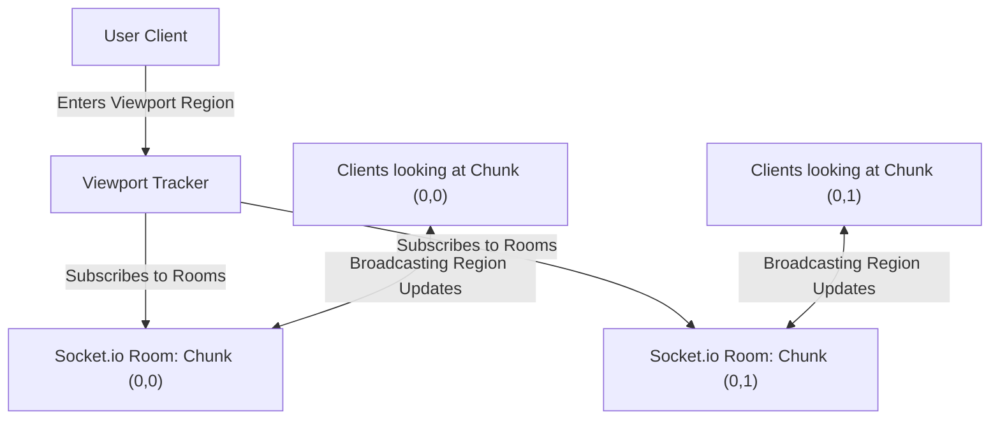

# Pixnette Phase 5: Future Scope Roadmap

This document outlines the architectural blueprints for the next phase of Pixnette's scalability and system monitoring.

---

## 📊 Phase 5.1: System Observability & Telemetry

To monitor system health under heavy load, track real-time WebSocket connection state, and debug performance bottlenecks, the following telemetry additions are planned:

### 1. OpenTelemetry Integration
- **Tracing:** Trace the lifespan of pixel placements starting from the client `place_pixel` Socket.io trigger, tracking processing latency through the rate-limit checks, Redis cache updates, and insertion into the transactional DB flusher queue.
- **Metrics Exporting:** Export system metrics to **Prometheus** and visualize them via **Grafana**:
  - **Socket Metrics:** Active websocket connections, handshake upgrade latency, and socket disconnection rates.
  - **Redis Metrics:** Memory usage, cache hit/miss ratio, and pub/sub throughput.
  - **Database Metrics:** Bulk-flush queue size, average write transactions latency, and connection pool saturation.

### 2. Live Telemetry Dashboard
- Introduce a secure, administrative endpoint (e.g., `/api/admin/metrics`) protected by basic auth or token access, displaying live dashboard analytics of active users and database flush logs.

---

## 🗺️ Phase 5.2: Chunked Canvas & Room-Based Scalability

Currently, all canvas updates are broadcast cluster-wide to all active users. While performant for a 64x64 board, scaling to 1024x1024 or higher requires partitioning both traffic and drawing operations.

### 1. Viewport-Based Room Partitioning
- Divide the large canvas into dynamic chunks (e.g., `128x128` grid blocks).
- Map each chunk to a unique Socket.io room channel (e.g., `room:chunk:0:0`, `room:chunk:0:1`).
- As the user pans and zooms, the client-side viewport controller detects visible chunks and sends join/leave requests to Socket.io.
- **Benefit:** Clients only receive WebSocket events for pixels currently visible on their screens, drastically reducing network egress bandwidth and client rendering overhead.

### 2. Dynamic DB Partitioning
- Divide the `pixels` database table physically or logically by coordinate quadrants to prevent read/write bottlenecks during bulk flushes on very large canvases.

---

## ⚡ Phase 5.3: Edge Caching & Cache Purging

To handle huge traffic spikes on initial canvas loads without overloading the origin VPS:
- **Cloudflare Edge Caching:** Configure Cloudflare to cache the `/api/canvas` binary payload at edge nodes.
- **On-Demand Purge Hooks:** When the backend flusher successfully writes a batch to Postgres (every 2 seconds), trigger a Cloudflare API call to purge the `/api/canvas` edge cache.
- **Benefit:** Visitors download the canvas board directly from Cloudflare’s CDN, bypassing your VPS completely unless a fresh database flush has just occurred.
